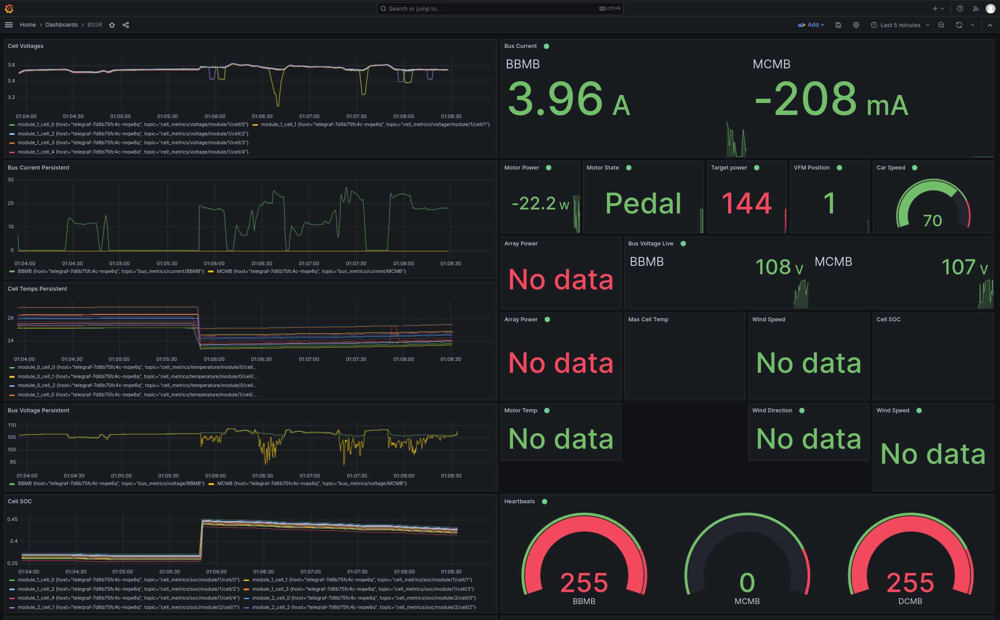

# Blue Sky Solar Racing Telemetry

This system is designed as a extensible solution for collecting and viewing solar car related metrics, both from the cars, as well as other sensors within the chase vehicle.

This is the current architecture of the system:

## Component Descriptions:

### BSSRSerial
Connects to the XBee radio board, and converts serial data from the solar car to MQTT Packets

### Windsensor
Connects to the windsensor via serial, parses the data, and sends out MQTT Packets

### Mosquitto
Broker which distributes all MQTT packets to the relevant locations

### Telegraf
Reads MQTT packets from Mosquitto and inserts relevant data into InfluxDB

### InfluxDB
Stores data for longterm analysis.

### Grafana
Renders the data.
* Live data from MQTT directly for realtime metrics such as car speed
* Graphs of the past few minutes of data (duration can be configured) from Influx

## Setup
Most of the components (Grafana, Mosquitto, Telegraf, and Influx) can be run as containers, Kubernetes config files are provided in ./kube Getting all of it running within rancher-desktop is fairly straghtforward.

BSSRSerial can be found inside the reciver folder, install pip install the requirements.txt, and edit the python file for the relevant serial port prior to running.

